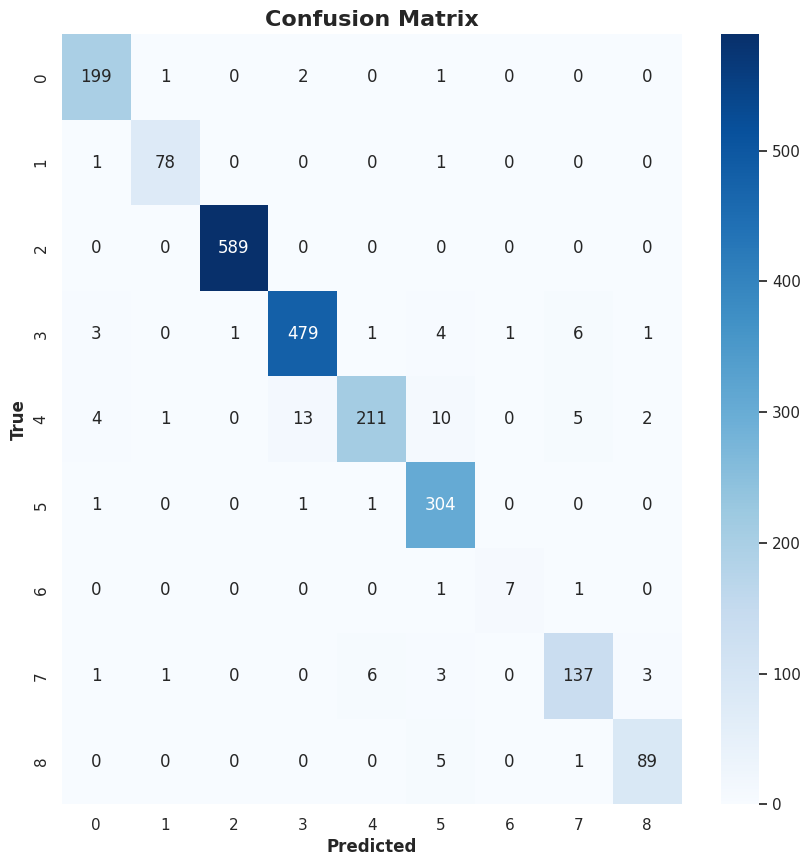
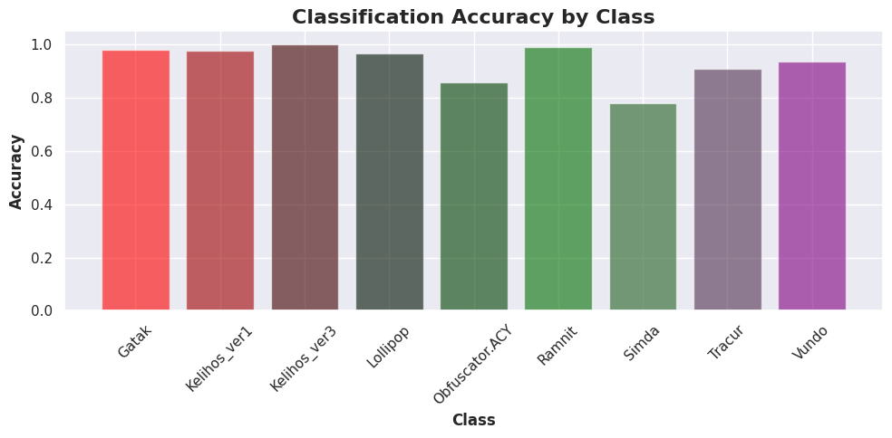
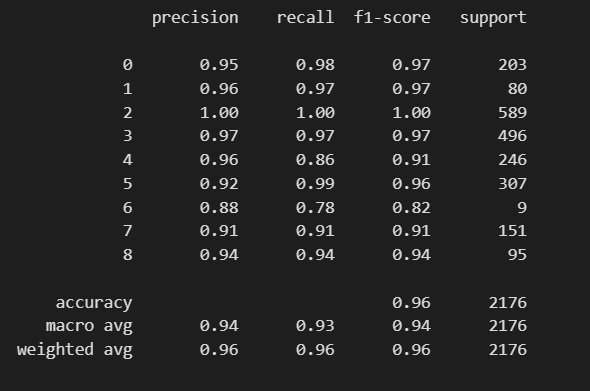
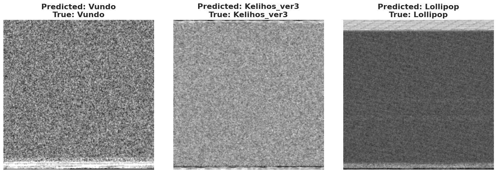
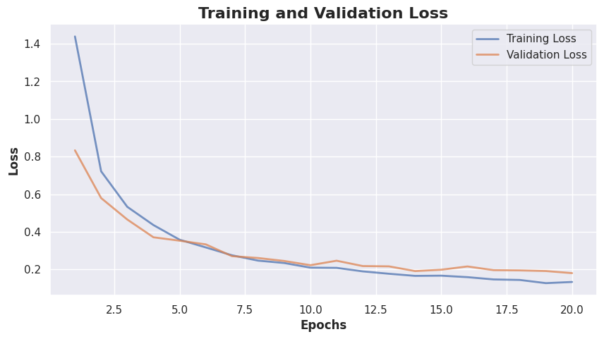

---

# One Image is Worth .exe Bytes: Malware Image Classification with CNN

### By - Ruşen Birben & Büşra Şahin  
**Honorable team members:** Anıl Dervişoğlu & Göktürk Dervişoğlu

---

## Project Overview

The primary goal of this project is to develop a Convolutional Neural Network (CNN) model to classify images of malware into various categories. Accurate classification of malware is crucial for effective threat identification and response in cybersecurity.

## Table of Contents
- [Project Overview](#project-overview)
- [Data Preparation](#data-preparation)
- [Model Definition](#model-definition)
- [Training](#training)
- [Testing and Evaluation](#testing-and-evaluation)
- [Visualization and Analysis](#visualization-and-analysis)
- [Significance](#significance)
- [How to Run the Code](#how-to-run-the-code)
- [Dependencies](#dependencies)

---

## Dataset

The dataset used in this project is the [Malware Classification Dataset](https://www.kaggle.com/datasets/mindtrinket/malwareclassificationdatasetimages/data) from Kaggle. It contains images of malware, categorized into different types, which are used for classification and analysis.

## Data Preparation

### Dataset Structure
Malware images are organized into class-specific folders:
```
/big2015_g/[train|test|val]/[class_name]/
```

### Data Splitting
- The dataset is split into training, validation, and test sets.
- **Stratified Splitting** is employed to ensure proportional representation of each class.

### Dataset Handling
- **Custom Dataset Class**: Manages the loading, preprocessing, and transforming of images.
- **Transforms**: Includes resizing, grayscale conversion, and normalization.

---

## Model Definition

### CNN Architecture
- The CNN is designed with:
  - **Convolutional Layers** for feature extraction.
  - **Pooling Layers** for dimensionality reduction.
  - **Fully Connected Layers** for classification.

### Implementation Details
- The model consists of three convolutional layers, max-pooling layers, ReLU activations, dropout, and normalization.
- The model is built using PyTorch and is optimized using the SGD optimizer.

---

## Training

### Training Process
- **Training**: The model is trained by minimizing the loss function.
- **Validation**: Performance is monitored using a validation set after each epoch.
- **Loss Curves**: Visualize the training and validation losses to assess the learning process.

---

## Testing and Evaluation

### Inference
- The trained model predicts labels for the test dataset to assess generalization.

### Evaluation Metrics
- **Confusion Matrix**: Used to visualize the model's performance across different classes.


- **Accuracy Metrics**: Provides insight into the model's ability to distinguish between malware classes.





---

## Visualization and Analysis

### Example Predictions
- Sample predictions are visualized to qualitatively assess the model’s performance.


### Loss Curves
- Plots of training and validation losses are generated to help detect overfitting.



---

## Significance

### Identifying Threats
- Accurate classification helps in timely responses and mitigation strategies.

### Improving Detection Systems
- A robust model can be integrated into security systems to enhance malware detection.

### Providing Insights
- Performance analysis aids in understanding the effectiveness of different features and model architectures in malware detection.

---

## How to Run the Code

**Note**: Since the dataset is on Kaggle, you can add a new notebook to the dataset via this [Malware Classification Dataset](https://www.kaggle.com/datasets/mindtrinket/malwareclassificationdatasetimages/data) link and upload the `mal_class.ipynb` file there to work on it. However, if you prefer to work locally, you can download the data from the link and then follow the instructions below.


1. **Clone the Repository**:
   ```bash
   git clone https://github.com/rusenbb/OmniLearn
   cd Omnilearn
   cd Classification_Malware_Detection_with_CNN
   ```

2. **Install Dependencies**:
   Ensure all dependencies are installed by using the provided `requirements.txt` file:
   ```bash
   pip install -r requirements.txt
   ```

3. **Prepare the Dataset**:
   - Organize the dataset as described in the *Dataset Structure* section.
   - Adjust paths in the code as necessary to point to the dataset.

4. **Run the Jupyter Notebook**:
   Open and run the notebook to execute the code:
   ```bash
   jupyter notebook mal_class.ipynb
   ```

---

## Dependencies

- `os`, `shutil`: For directory and file operations.
- `PIL.Image`: For image processing.
- `numpy`: For numerical operations.
- `matplotlib.pyplot`, `seaborn`: For data visualization.
- `tqdm`: For progress bars.
- `sklearn.metrics`, `sklearn.model_selection`: For evaluating and splitting the dataset.
- `torch`, `torchvision`: For deep learning and data transformations.

---

**Note**: Ensure the availability of a GPU for faster training, as the model is computationally intensive.

---
